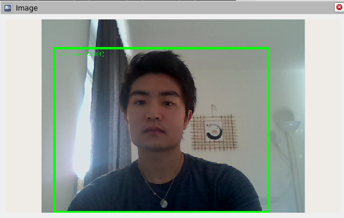

# ros2-object-detection-using-mediapipe
## Overview
This package allows you to detect objects in the input image.  
This is only tested in ROS humble. However, it should work with other ROS2 versions.  

This package is using [Mediapipe's Object Detection](https://developers.google.com/mediapipe/solutions/vision/object_detector). Check more about it on their website.

## Installation
### Running in Docker
1. `bash build.sh`
2. `cd docker`
3. `docker compose up`
4. `docker exec -it object_detection bash`
5. `ros2 launch object_detection object_detection_launch.py`

## Usage
Run the main node with  
`ros2 launch object_detection object_detection_launch.py`

## Config files
### object_detection.yaml
Contains parameters for `object_detection_node.py`

## Launch files
### object_detection_launch.py
Launches `object_detection_node.py`  
All the parameters for this launch file are described in the Nodes section.

## Nodes
### object_detection_node.py
1. Subscribe to a camera topic
2. Detect objects in the given image
3. Publish the result image

#### Subscribed topics
| Topic | Message Type | Description |
|-------|---|---|
| /camera/color/image_raw | sensor_msgs/Image | Input for object detection |

#### Published topics
| Topic | Message Type | Description |
|-------|---|---|
| /object_detection/image | sensor_msgs/Image | Image with bounding boxes |
| /object_detection/result | object_detection_msgs/DetectionResult | Object detection results|

DetectionResult:
- detections
    - Detection
        - bounding_box
        - score
        - name

#### Parameters
| Name | Type | Default | Description |
|-------|---|---|---|
| topic_image | str | "/camera/color/image_raw" | Topic name for RGB image |
| max_results | int | 5 | Max number of objects to detect |